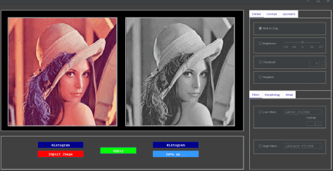

# Image-Processing-Tool


<div id="top"></div>

<p align="center">
<a href="https://github.com/kerimsenturk5734/Image-Processing-Tool/blob/main/LICENSE.md" target="blank">

</a>
<a href="https://github.com/kerimsenturk5734/Image-Processing-Tool/fork" target="blank">

</a>
<a href="https://github.com/kerimsenturk5734/Image-Processing-Tool/stargazers" target="blank">

</a>
<a href="https://github.com/kerimsenturk5734/Image-Processing-Tool/issues" target="blank">

</a>
<a href="https://github.com/kerimsenturk5734/Image-Processing-Tool/pulls" target="blank">

</a>
</p>


<!-- PROJECT LOGO -->
<br />
<div align="center">
  
  <h3 align="center">Image-Processing-Tool</h3>

  <p align="center">
    <a href="https://github.com/kerimsenturk5734/Image-Processing-Tool">
    
    </a>
    
   This repository contains basic Image processing functions more than 20.
    <br/>
    <div>
      ```
        🟥That project developed for midterm grading of "Image Processing" course  in grade 3 term fall.🟥 ```<br>``` 
        🟥Not used a Image Processing Library like OpenCV.🟥
      ```
    <div/>
    <hr>
    <br />
    <a href="https://github.com/kerimsenturk5734/Image-Processing-Tool"><strong>Explore the docs »</strong></a>
        <br/>
   ·<a href="https://github.com/kerimsenturk5734/Image-Processing-Tool/issues">Report Bug</a>·
      <br/>
      <br/><br/>
    <a href="https://github.com/kerimsenturk5734/Image-Processing-Tool/blob/main/README-tr.md" target="_blank" rel="noreferrer"> 
      ```Türkçe```
    </a> &nbsp;&nbsp;&nbsp;&nbsp;&nbsp;&nbsp;
      <a href="https://github.com/kerimsenturk5734/Image-Processing-Tool/blob/main/README.md" target="_blank" rel="noreferrer"> 
      ```English```
    </a>  
</div>


<!-- TABLE OF CONTENTS -->
<div align="left">
    <details>
      <summary>Contents</summary>
      <ol>
        <li>
          <a href="#about-the-project">About The Project</a>
          <ul>
            <li><a href="#built-with">Built With</a></li>
          </ul>
        </li>
        <li>
          <a href="#getting-started">Getting Started</a>
          <ul>
            <li><a href="#prerequisites">Prerequisites</a></li>
            <li><a href="#installation">Installation</a></li>
          </ul>
        </li>
        <li><a href="#contact">Contact</a></li>
      </ol>
    </details>
<div/>


<!-- ABOUT THE PROJECT -->
## About The Project

<!--projeyi anlat gif olarak kullanımını göster-->

<table>
  <caption><b style="color:yellow">Functions</b></caption>
  <tr>
    <th><b style="color:red;">Dotted Functions</b></th>
    <td>Image To Gray</td>
    <td>Brightness Adjusting</td>
    <td>Threshold</td>
    <td>Negative Image</td> 
  </tr>
  <tr>
    <th><b style="color:red;">Contrast Functions</b></th>
    <td>Contrast Adjusting</td>
    <td>Contrast Stretching</td>
    <td>Histogram Equalization</td>
  </tr>
  <tr>
    <th><b style="color:red;">Geometric Functions</b></th>
    <td>Invert-X,Invert-Y</td>
    <td>Set Offset</td>
    <td>Rotate</td>
    <td>Scale (Working on...)</td>
  </tr>
  <tr>
    <th rowspan=2><b style="color:red;">Filter Functions</b></th>
    <th><b style="color:blue;">Low Filters</b></th>
    <td>Gauss Filter</td>
    <td>Mean Filter</td>
    <td>Median Filter</td>
  </tr>
  <tr>
    <th><b style="color:green;">Hight Filters</b></th>
    <td>Laplace Filter</td>
    <td>Sobel Filter</td>
    <td>Prewitt Filter</td>
  </tr>
  <tr>
    <th><b style="color:red;">Morphology Functions</b></th>
    <td>Dilation</td>
    <td>Eroditation</td>
    <td>Opening</td>
    <td>Closing</td>
  </tr>
  <tr>
    <th><b style="color:red;">Morphology Functions</b></th>
    <td>Perspective Transform</td>
    <td>Sharpening by Convolution</td>
  </tr>
</table>

  <p align="center"></p>
<p align="right">(<a href="#top">back to top</a>)</p>


### Built With

<p align="left"> 
  <a href="https://www.java.com" target="_blank" rel="noreferrer">  </a> <a href="https://www.eclipse.org/" target="_blank" rel="noreferrer">  </a> <a href="https://www.formdev.com/flatlaf/" target="_blank" rel="noreferrer">  </a>
  <a href="https://www.jfree.org/jfreechart/">
   </a>
    </p>
<p align="right">(<a href="#top">back to top</a>)</p>


<!-- GETTING STARTED -->
## Getting Started

### Prerequisites

1. Java 17
2. Eclipse IDE

### Installation

1. Clone the repo
   ```sh
   git clone https://github.com/kerimsenturk5734/Image-Processing-Tool
   ```
2. ```File > Import > Install > From Existing Installation```  and select the project folder in Eclipse.
   
3. Finish.
  


<!-- CONTACT -->
## Contact

<p align="left">
<a href="https://twitter.com/kersenturk57" target="blank"></a>
<a href="https://www.linkedin.com/in/kerim-%c5%9fent%c3%bcrk-784a3220a/" target="blank"></a>
<a href="https://stackoverflow.com/users/16939669" target="blank"></a>
<a href="https://www.instagram.com/s1r_ker1m/" target="blank"></a>
</p>

<p align="right">(<a href="#top">back to top</a>)</p>

<p>&nbsp;</p>

